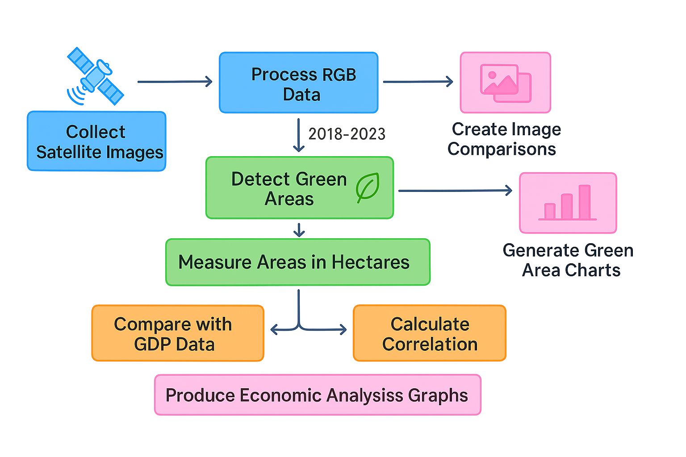
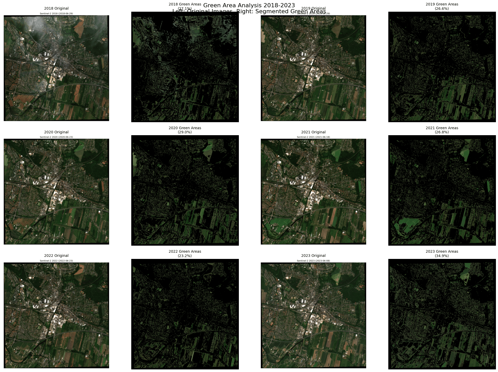
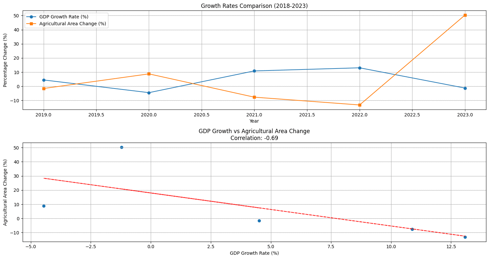

# EnvironmentalData

# 🌍 Urban Resilience & Environmental Data Toolkit

This repository contains two Jupyter Notebooks designed to support urban resilience mapping and environmental data analysis using satellite imagery and geospatial methods. Developed for academic, planning, and research purposes, these notebooks provide a foundation for spatial analysis and resilience assessment in urban contexts. These tools are designed to be easily extended for new datasets or additional indicators in future research.

---

## 📁 Contents

### `EnvironmentalData_ESE.ipynb`
**Purpose:** Fetch and process satellite imagery for environmental analysis.

**Features:**
- Defines geographic areas of interest (AOIs)
- Connects to satellite imagery providers (e.g., Google Earth Engine, SentinelHub)
- Downloads and visualizes imagery data
- Lays the groundwork for time-series or vegetation analysis

---

### `Mapping Urban Resilience Template.ipynb`
**Purpose:** Template for mapping urban resilience using environmental and infrastructural data.

**Features:**
- Explores resilience indicators (e.g., flood zones, green coverage, density)
- Combines multiple layers of spatial data
- Uses thematic mapping techniques to visualize vulnerabilities
- Serves as a customizable framework for different cities or districts

---

## 🚀 Getting Started

### 1. Clone the Repository

git clone https://github.com/yourusername/urban-resilience-toolkit.git
cd urban-resilience-toolkit

### 2. Setup Environment

pip install -r requirements.txt

Before you begin, ensure you have Python 3.8 or newer installed on your system.

